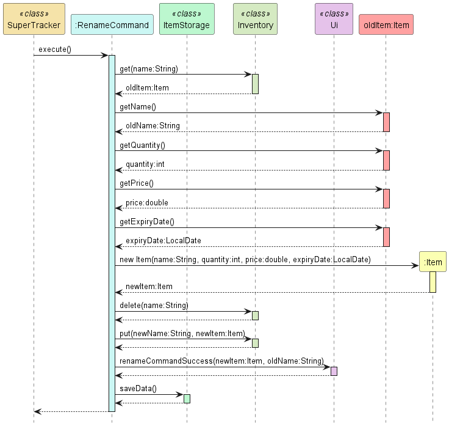

# Developer Guide

## Acknowledgements
- [CS2113 Website](https://nus-cs2113-ay2324s2.github.io/website/index.html)
- [AB-3 User Guide](https://se-education.org/addressbook-level3/UserGuide.html)
- [AB-3 Developer Guide](https://se-education.org/addressbook-level3/DeveloperGuide.html)
- [PlantUML Docs](https://plantuml.com)
- and most importantly our Professor **Akshay Narayan** and TA **Vishruti Ranjan** who guided us along this project :D

## Design & implementation

### Input Parsing
The program handles user inputs in the Parser class where inputs are parsed into command classes that implement the Command interface. 
The Parser class only contains static methods as we have determined that it would be more practical instead of instantiating an instance of a Parser class.

> Note on the command inputs:
> - All valid command inputs by the user will have a command word _(first word separated by whitespace)_ with its respective parameters following the word.
> - Each parameter must be entered following a flag, i.e. a name parameter will have the input `n/NAME`

The following is a class diagram of the `Parser` and its relevant dependencies\

The following is a sequence diagram of the execution sequence of a single user input\

`Parser+parseCommand(input)` will return a `Command` object according to the command word in the user input.
It returns an `InvalidCommand` class if the command word detected is invalid.

For the parsing of valid command word inputs, `Parser+parseCommand(input)` passes the parameters of the user input into the respective command's parsing method, 
then calls the method `Parser-getPatternMatcher(regex, input, paramFlags)`that returns a `Matcher` object, which is Java's regex pattern matcher.
We use regular expressions to simplify the process of pattern matching for input parameters. Each command will have their respective regex strings for pattern matching

> Note that `Parser-getPatternMatcher(regex, input, paramFlags)` will be called as long as the command word in the user input is valid,
> even if the parameters are invalid. The `Matcher` object returned will try to match the input parameters to the given regex.
> A `TrackerException` will be thrown if the input parameters are invalid.

The input parameters will be passed into another method, `Parser-makeStringPattern(inputParam, paramFlags)` that returns a string in a pattern
according to a preset format that contains all the necessary input parameters.
Converting the parameter string to a pattern is done because **order does not matter** in the user's input parameters _(if there are multiple parameters)._
Thus, it would be necessary to convert the user's input into a consistent format for pattern matching using regex.

> Note: 
> - All command regex are in the format:\
>   `a/(?<grp1>.*) b/(?<grp2>.*) c/(?<grp3>.*) ` with `a/`, `b/`, `c/` being the respective parameter flags
>   and `/` as the flag character.
>   - Parameter flags can contain more than 1 character right before the `/`
>   - Suppose we have `a/aaa b/bbb c/ccc ` as an input, according to the regex above, 
>   aaa will be in the named capture group "grp1", bbb in "grp2", ccc in "grp3"
> - If a parameter is optional, we would have it in a non-capture group with a `?` at the end
>   - i.e. in `a/(?<grp1>.*) (?<grp2>(?:b/.*)?)`, the `b/` flag is an optional parameter
> - There also must be a white space before any valid input parameter flag in the user inputs
>   - i.e. in `a/(?<grp1>.*) (?<grp2>(?:b/.*)?)`, the input `a/__b/_` will take `__b/_` to be inside "grp1" and "grp2"
>   will be empty
> 
> For example, suppose the program wants to match the user input parameter
> `c/coconut a/apple b/bear a/anaconda d/donkey` to the regex `a/(?<grp1>.*) b/(?<grp2>.*) c/(?<grp3>.*) (?<grp4>(?:e/.*)?)`
> 1. The input parameter string and a string array of flags `{a, b, c, e}` is passed into `Parser-makeStringPattern(...)`
> 2. `Parser-makeStringPattern` will return a pattern string `a/apple b/bear c/coconut `
> 3. The program will then try to match the pattern string `a/apple b/bear c/coconut ` to the regex `
> a/(?<grp1>.*) b/(?<grp2>.*) c/(?<grp3>.*) (?<grp4>(?:e/.*)?)`
> 4. The above pattern string matches the regex, with the following strings in the named capture groups:
>    - "grp1": apple
>    - "grp2": bear
>    - "grp3": coconut
>    - "grp4": is empty

The `Matcher` will detect whether this input string pattern match the given regex pattern given to it
and extract out the necessary information if there is a match. 
This will be used by each command's respective parsing method and returns the relevant parsed `Command`
object to `SuperTracker+handleCommands()`

### File Saving and Loading
Currently, the program handles 2 classes of save data, `Item` and `Transaction`.
Saving and loading data of these objects is performed by the `ItemStorage` and `TransactionStorage` classes that inherit
from the `FileManager` class. As the program is running, `Item` objects will be stored in the `Inventory` class,
while `Transaction` objects will be stored in the `TransactionList` class. 

#### Item objects
The following is a class diagram of `ItemStorage` and its relevant dependencies\

Take note that the `Command` class in the diagram refers to the classes that implement the `Command` interface and make changes to the item list in `Inventory`

##### **Saving**
Saving is performed automatically each time the item list is updated. Currently, there are only 6 commands that can make changes to
the item list and will call `ItemStorage+saveData()` at the end of `CommandClass+execute()`.
> Commands that call `ItemStorage+saveData()` in `execute()`:
> - `NewCommand`
> - `UpdateCommand`
> - `DeleteCommand`
> - `AddCommand`
> - `RemoveCommand`
> - `RenameCommand`

Item data is saved into a text file in `./data/items.txt` by generating a string for each `Item` in the list, containing the attributes of the `item`.
The string generated will have the attributes in the format and order of `NAME,QUANTITY,PRICE,EXPIRY_DATE`. Since an `Item`'s expiry date is
optional, `EXPIRY_DATE` can be the string `"no date"` if the expiry date is determined to not exist. This string will be written to the text file as mentioned.
> For example, suppose the program wants to save the `Item` with attributes `name = "Apple"`, `quantity = 5`, `price = 2.55`, `expiryDate = 19-04-2024`
> and the program uses `",,,"` as a file delimiter between groups.\
> The program generates the string `"Apple ,,, 5 ,,, 2.55 ,,, 19-04-2024 ,,, end"` with `end` signifying the end of the data string.\
> Do note that the `end` is only a placeholder and can be any string of characters.
> > If for some reason the user was able to enter the file delimiter, such as `",,,"`, as an item name using the `new` or `rename` commands,
> > when the program saves, it will replace every occurrence of the file delimiter in the name to a placeholder character sequence, like `"*&_"`,
> > in the converted data string to prevent the program from saving data that is deemed corrupted on the next load.

This string is generated by the method `ItemStorage-getItemData()`

##### **Loading**
Loading is performed at the start of the program in `SuperTracker-run()` where it calls the method `ItemStorage+loadData()`.
`loadData()` looks for the save text file at `./data/items.txt` and reads the lines from the file `items.txt` if it exists. As indicated earlier,
each line containing a single `Item`'s data will be in the format and order of `NAME,QUANTITY,PRICE,EXPIRY_DATE`. Each attribute will be parsed into its
relevant data type, creating a new `Item` with the extracted attributes, which is then added to the item list in `Inventory`. In the event where the line
of data read is not in the correct format, or the attributes are unable to be parsed into its relevant data type _(i.e. the string in the QUANTITY part reads "f1ve" instead of "5")_,
the line will be ignored and a new `Item` will not be added to the list. The corrupted lines of data will also be erased from the save file.

The parsing of string data to an `Item` object is handled by the method `ItemStorage-parseItemData()`.

#### Transaction objects
The following is a class diagram of `TransactionStorage` and its relevant dependencies\

Take note that the `Command` class in the diagram refers to the classes that implement the `Command` interface and add transactions to list in `TransactionList`

The saving and loading is largely similar to that of Item objects detailed above.

##### **Saving**
Currently, there are only 3 commands that can make changes to
the item list and will call `TransactionStorage+saveTransaction()` at the end of `CommandClass+execute()`.
> Commands that call `TransactionStorage+saveTransaction()` in `execute()`:
> - `BuyCommand`
> - `SellCommand`
> - `ClearCommand`

Transaction data is saved into a text file in `./data/transactions.txt` by generating a string the newly added `Transaction` in the list, containing the attributes of the `Transaction`.
The string generated will have the attributes in the format and order of `NAME,QUANTITY,PRICE,TRANSACTION_DATE,TYPE`. This string will be appended to the end of the data file as mentioned.
If the data file does not exist while the program calls `TransactionStorage+saveTransaction()`, the data file will be recreated and all transaction data
currently in the program will be re-saved using the string format above in the method `TransactionStorage-saveAllTransactions()`. If the user clears transaction data, the program calls the
method `TransactionStorage+resaveAllTransactions()` instead which rewrites the whole save file using the same methods as above with all transactions in the list.
> For example, suppose the program wants to save the `Transaction` with attributes `name = "Apple"`, `quantity = 5`, `price = 2.55`, `transactionDate = 19-04-2024, type = "s"`
> and the program uses `",,,"` as a file delimiter between groups.\
> The program generates the string `"NAME: Apple ,,, QTY: 5 ,,, PRICE: 2.55 ,,, DATE: 19-04-2024 ,,, T: s ,,, end"` with `end` signifying the end of the data string.\
> Do note that the `end` is only a placeholder and can be any string of characters.
> > To justify why the saved string format is different from `Item` objects, the save file of `Transaction` objects can also act as a receipt of the user's expenses, thus it is made more readable.

The string is generated by the method `TransactionStorage-getTransactionData()`

##### **Loading**
`SuperTracker.run()` calls `TransactionStorage+loadTransactionData()` at the beginning of the program.
`loadTransactionData` looks for the save file `./data/transactions.txt` and reads the lines from `transactions.txt` if it exists. The attributes
of a `Transaction` is extracted from the line and a new `Transaction` object is created and put in the `TransactionList` class. Similar to loading `Item` data,
corrupted `Transaction` data will be dealt with accordingly.
> Note: Including the criteria for corrupted data in `Item` data, if a transaction date has been edited such that the new date is of a date that has not occurred yet,
> _(e.g. changing a date from today to 1 year from today)_, this will also be treated as corrupted 'Transaction' data.

### New Command
The following is a class diagram of the NewCommand and its relevant dependencies 

The `NewCommand` class implements the `Command` interface and is responsible for handling the creation of new items in the `Inventory`.
A NewCommand instance is created by the `parseNewCommand` method called by Parser, which ensures that the provided parameters (name, quantity, price, expiry date) are valid.

#### Dependencies
- `Item`: For creating the new item
- `Inventory`: For adding the new item into the inventory
- `Ui`: To notify the user about the successful execution of `NewCommand`
- `FileManager`: To save the new item added onto the hard disk

The following sequence diagram shows the execution of a NewCommand 

1. The `SuperTracker` class calls the `execute` method of `NewCommand`
2. A new `Item` object with the given parameters (name, quantity, price, expiry date) is created and returned to `NewCommand`
3. The `put` method of the `Inventory` class is called to add the newly created item into the inventory
4. The `newCommandSuccess` method of the `Ui` class is called to notify that `NewCommand` has been successfully executed
5. The `saveData` method of the `FileManager` class is called to save the new item added onto the hard disk

> Note that if the user inputs a name parameter that contains the file delimiter of the save file, the file delimiter in the name will be
> replaced. e.g. If the file delimiter is determined to be `",,,"`, the item name `"app,,,le` will be renamed to `"app_le"`

### Update Command
The following is a class diagram of the UpdateCommand and its relevant dependencies 

The `UpdateCommand` class implements the `Command` interface and is responsible for updating existing items in the 
`Inventory`. A UpdateCommand instance is created by the `parseUpdateCommand` method called by Parser, which ensures 
that the provided parameters (name, quantity, price) are valid. While it is optional to include quantity and price, one
of the aforementioned parameters must be provided.

#### Dependencies
- `Item`: For getting the quantity and price of the to be updated item
- `Inventory`: For updating the item in the inventory
- `Ui`: To notify the user about the successful execution of `UpdateCommand`

The following sequence diagram shows the execution of a UpdateCommand 

1. The `SuperTracker` class calls the `execute` method of `UpdateCommand`
2. The item object of the item to be updated is obtained from `inventory`
3. There is an optional check for newQuantity being -1 (an invalid value that indicates that quantity should not be 
updated). If the condition holds true it retrieves the item's previous quantity.
4. There is another optional check for newPrice being -1 (an invalid value that indicates that price should not be
   updated). If the condition holds true it retrieves the item's previous price.
5. A new `Item` object with the given parameters (name, new quantity, new price, old expiry date) is created and returned to `UpdateCommand`
6. The `put` method of the `Inventory` class is called to update the item in the inventory
7. The `UpdateCommandSuccess` method of the `Ui` class is called to notify that `UpdateCommand` has been successfully executed
8. The `saveData` method of the `FileManager` class is called to save updated item onto the hard disk

### DeleteCommand
The following is a class diagram of the DeleteCommand and its relevant dependencies 

The `DeleteCommand` class implements the `Command` interface and is responsible for deleting existing items in the
inventory. A DeleteCommand instance is created when calling the `parseDeleteCommand` method called in Parser class.
This method parses the input and ensures that the command parameter (item name) exists in the inventory. The `execute()`
method in the class will call the `delete` method from `Inventory` class to remove the item. It will then execute
the `saveData` method from `FileManager` class to save changes to the inventory.

#### Dependencies
- `Inventory`: Checking and deleting item from inventory
- `Ui`: To notify the user about the successful execution of `DeleteCommand`

The following sequence diagram shows the execution of a DeleteCommand 

1. The `SuperTracker` class calls the `execute` method of `DeleteCommand`
2. The `contains` method of `Inventory` to check if the item exists in the inventory
3. If item exists, the `delete` method of `Inventory` is called to remove the item from inventory
4. Subsequently, the `deleteCommandSuccess` method of `Ui` is called to print the delete message
5. The `saveData` method of `FileManager` is called to save the change to the text file containing inventory information

### Find Command
The following is a class diagram of the FindCommand and its relevant dependencies 

The `FindCommand` class implements the `Command` interface and is responsible for searching for items in the inventory by name.
A FindCommand instance is created by the `parseFindCommand` method called by `Parser`, which ensures that the provided parameter (name) is valid.

#### Dependencies
- `Inventory`: For getting the list of items in the inventory
- `Ui`: To notify the user about the successful execution of `FindCommand`

The following sequence diagram shows the execution of a FindCommand   

1. The `SuperTracker` class calls the `execute` method of `FindCommand`
2. A boolean variable `isFound` is assigned a false value 
3. The `getItems` method of the `Inventory` class is called to get the list of items in the inventory
4. The `FindCommand` class will loop through each item of the list of items
5. On every iteration, the item will be checked if it contains the word that is to be found
6. If the item contains the word, the `foundItem` method of the Ui class is called and the `isFound` variable is assigned a true value
7. After the loop ends, if the `isFound` variable is still false, the `noItemFound` method of the Ui class is called to notify that no item has been found containing the word

### Rename Command
The following is a class diagram of the RenameCommand and its relevant dependencies 

The `RenameCommand` class implements the `Command` interface and is responsible for renaming an item chosen by the user.
A RenameCommand instance is created by the `parseRenameCommand` method called by `Parser`, which ensures that the provided parameter (name and newName) is valid.

#### Dependencies
- `Inventory`: For getting the chosen item in the inventory
- `Ui`: To notify the user about the successful execution of `RenameCommand`

The following sequence diagram shows the execution of a RenameCommand   

1. The `SuperTracker` class calls the `execute` method of `RenameCommand`
2. The item object of the item to be renamed is obtained from `inventory`
3. The quantity, price and expiry date are obtained from the item
4. A new `Item` object with the given parameters (newName, quantity, price, expiry date) is created and returned to `RenameCommand`
5. The `put` method of the `Inventory` class is called to put the new item in the inventory
6. The `delete` method of the `Inventory` class is called to delete the old item
7. The `RenameCommandSuccess` method of the `Ui` class is called to notify that `RenameCommand` has been successfully executed
8. The `saveData` method of the `FileManager` class is called to save renamed item onto the hard disk

### List Command
The following is a class diagram of the FindCommand and its relevant dependencies 

The `ListCommand` class implements the `Command` interface and is responsible for printing out a list of items in the inventory to the output.
A ListCommand instance is created by the `parseListCommand` method called by Parser, which parses the user input to determine how the list should be printed out.

#### Dependencies
- `Item`: For getting the comparator needed to sort the list of items
- `Inventory`: For getting the list of items in the inventory
- `Ui`: To print the list of items in the inventory to the output

The 7 parameters in the constructor `firstParam`, `secondParam`, `thirdParam`, `firstSortParam`, `secondSortParam`, `thirdSortParam`, `isReverse` 
are used to determine how the list should be printed out.
- `firstParam`,`secondParam`,`thirdParam`
  - Used to determine if quantity, price and/or expiry date should be printed out and in what order  
    e.g. If the command specifies `list q/ p/ e/`, for each item quantity will be printed out first followed by price and expiry date
  - Can only take 4 possible values `"q"`,`"p"`,`"e"`,`""`
  - Value corresponds to the order of the flags in the command  
    e.g. If the command specifies `list p/ e/ q/`, then `firstParam == "p"`, `secondParam == "e"`, `thirdParam == "q"` 
  - `""` will be the default value if there are less than 3 flags in the command  
    e.g. If the command specifies `list e/`, then `firstParam == "e"`, `secondParam == ""`, `thirdParam == ""`
- `firstSortParam`,`secondSortParam`,`thirdSortParam`
  - Used to determine how the list should be sorted and in what order in the event of ties  
    e.g. If the command specifies `list sq/ sp/ se/`, list will be sorted in order of ascending quantity.
    Ties will be sorted in order of ascending price, then ascending date, followed by ascending alphabetical order (A-Z)
  - Can only take 4 possible values `"q"`,`"p"`,`"e"`,`""`
  - Value corresponds to the order of the sorting flags in the command  
    e.g. If the command specifies `list sp/ se/ sq/`, then `firstSortParam == "p"`, `secondSortParam == "e"`, `thirdSortParam == "q"`
  - `""` will be the default value if there are less than 3 flags in the command  
    e.g. If the command specifies `list se/`, then `firstSortParam == "e"`, `secondSortParam == ""`, `thirdSortParam == ""`
- `isReverse`
  - True if the user has input the reverse flag `r/`, false otherwise.

There are 8 main sorting modes in total
1. `list`: Alphabetical ascending (e.g. A-Z)
2. `list r/`: Alphabetical descending (e.g. Z-A)
3. `list sq/`: Quantity ascending
4. `list sq/ r/`: Quantity descending
5. `list sp/`: Price ascending
6. `list sp/ r/`: Price descending
7. `list se/`: Expiry date ascending (e.g. 2024-2025)
8. `list se/ r/`: Expiry date descending (e.g. 2025-2024)

The following sequence diagram shows the execution of a ListCommand   

1. The `SuperTracker` class calls the `execute` method of `ListCommand`
2. The `getItems` method of the `Inventory` class is called to get an `ArrayList` of items in the inventory
3. The `listIntro` method of the `Ui` class is called to print out the total number of items in the inventory
4. The private method `sortBy` is called 4 times with different input parameters to sort the `ArrayList` of items according to alphabet, quantity, price and/or expiry date 
5. If `isReverse` is true, the `reverse` method of the `Collections` class is called to reverse the `ArrayList` of items
6. For each item in the list, the `listItem` method of the `Ui` class is called to print each item to the output

### Help Command
The following is a class diagram of the HelpCommand and its relevant dependencies 

The HelpCommand class implements the Command interface and is responsible for assisting users with various tasks.
A HelpCommand instance is created by the parseHelpCommand method called by Parser, which ensures that the provided parameter (task) is valid.

#### Dependencies
- `Ui`: To print out a line
- `HelpCommandUi`: To print various messages and parameters

The following sequence diagram shows the execution of a HelpCommand   

1. The `SuperTracker` class calls the `execute` method of `HelpCommand` 
2. The `helpCommandSuccess` method of the `HelpCommandUi` class is called to notify that the help command has been successfully executed
3. `helpCommandSuccess` will also print a list of functions available for user to input
4. Upon choosing a valid function, the `printCommandParams` method of the `HelpCommandUi` is called to print the parameters needed for the chosen function
5. The `helpClosingMessage` method of the `HelpCommandUi` class is then called to notify that the user has been returned to the main console

## Product scope
### Target user profile

{Describe the target user profile}

### Value proposition

{Describe the value proposition: what problem does it solve?}

## User Stories

| Version | As a ...                          | I want to ...                                                         | So that I can ...                                                                                         |
|---------|-----------------------------------|-----------------------------------------------------------------------|-----------------------------------------------------------------------------------------------------------|
| v1.0    | user                              | use a command line interface with simple commands                     | navigate through the app quickly                                                                          |
| v1.0    | user                              | enter input parameters in any order I want                            | have flexibility in entering input parameters                                                             |
| v1.0    | user                              | add and delete product items                                          | so that I can modify the list of items in my inventory                                                    |
| v1.0    | user                              | list the full inventory of my products                                | know all products that are in my inventory                                                                |
| v1.0    | user                              | know the specific number of items in the inventory                    | keep track of the quantity of items available                                                             |
| v1.0    | user                              | know the price of an item in the inventory                            | draw correlations between price and sales                                                                 |
| v1.0    | user                              | update an item's price and stock                                      | edit the parameters of my product item as I want                                                          |
| v1.0    | user                              | add/remove a certain number of an item's quantity without calculation | modify an item's quantity simply without needing to do math                                               |
| v1.0    | user unfamiliar with the commands | be shown error messages informing me of my invalid inputs             | know which part of my input is incorrect/invalid when I have entered an invalid command                   |
| v2.0    | user                              | sort my items by the parameter of my choice                           | view my items in a sorted manner                                                                          |
| v2.0    | user                              | save the items in my inventory to the hard disk                       | avoid having to re-enter all items in the inventory into the program after I quit and restart the program |
| v2.0    | user                              | add expiry dates to my product items                                  | keep track of how long these items can be stored                                                          |
| v2.0    | user                              | search for an item names that contain a specific keyword              | search for specific items in my inventory                                                                 |
| v2.0    | user                              | view a list of items that have quantity less than a number I specify  | track items that are low in stock                                                                         |
| v2.0    | user                              | view a list of items that have expired or are close to expiry         | be informed of whether I can keep the items in my inventory                                               |
| v2.1    | new user                          | see usage instructions                                                | refer to them when I forget how to use the application                                                    |
| v2.1    | user                              | keep a record of my transactions (e.g. buying and selling of items)   | be informed of all my transactions and expenses                                                           |
| v2.1    | user                              | know my expenditure, revenue and profit                               | check and keep track of how much money I am spending/earning                                              |
| v2.1    | user                              | rename an existing item in the inventory                              | update the name of a product item without having to delete it                                             |

## Non-Functional Requirements

{Give non-functional requirements}

## Glossary

* *glossary item* - Definition

## Instructions for manual testing

{Give instructions on how to do a manual product testing e.g., how to load sample data to be used for testing}
