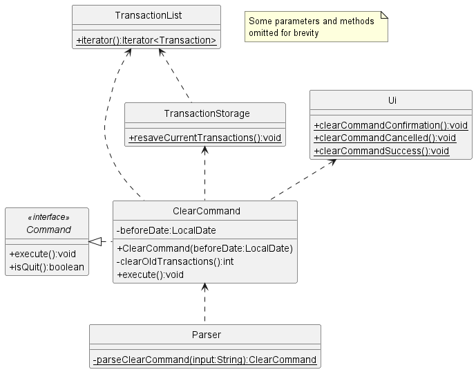
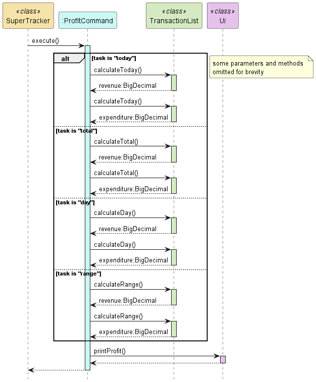

# Developer Guide

- [Acknowledgements](#acknowledgements)
- [Design](#design)
  - [Architecture](#architecture)
  - [Parser Component](#parser-component)
  - [Storage Component](#storage-component)
- [Implementation](#implementation)
  - [New Command](#new-command)
  - [Update Command](#update-command)
  - [Add Command](#add-command)
  - [Remove Command](#remove-command)
  - [Delete Command](#delete-command)
  - [Find Command](#find-command)
  - [Rename Command](#rename-command)
  - [List Command](#list-command)
  - [Report Command](#report-command)
  - [Buy Command](#buy-command)
  - [Sell Command](#sell-command)
  - [Clear Command](#clear-command)
  - [Expenditure Command](#expenditure-command)
  - [Revenue Command](#revenue-command)
  - [Profit Command](#profit-command)
  - [Help Command](#help-command)
- [Appendix: Requirements](#appendix-requirements)
  - [Product Scope](#product-scope)
  - [User Stories](#user-stories)
  - [Non Functional Requirements](#non-functional-requirements)
  - [Glossary](#glossary)
- [Appendix: Instructions for Manual Testing](#appendix-instructions-for-manual-testing)
  - [Saving data](#saving-data)
  - [Create a new item](#create-a-new-item)
  - [Delete an item](#delete-an-item)
  - [Increase quantity](#increase-quantity)
  - [Decrease quantity](#decrease-quantity)
  - [Update an item](#update-an-item)
  - [Find an item](#find-an-item)
  - [Rename an item](#rename-an-item)
  - [List all items](#list-all-items)
  - [Print report](#print-report)
  - [Buy items](#buy-items)
  - [Sell items](#sell-items)
  - [Clear transactions](#clear-transactions)
  - [Print expenditure](#print-expenditure)
  - [Print revenue](#print-revenue)
  - [Print profit](#print-profit)
  - [Print a help list](#print-a-help-list)
  - [Quit the program](#quit-the-program)

## Acknowledgements
- [CS2113 Website](https://nus-cs2113-ay2324s2.github.io/website/index.html)
- [AB-3 User Guide](https://se-education.org/addressbook-level3/UserGuide.html)
- [AB-3 Developer Guide](https://se-education.org/addressbook-level3/DeveloperGuide.html)
- [PlantUML Docs](https://plantuml.com)
- and most importantly our Professor **Akshay Narayan** and TA **Vishruti Ranjan** who guided us along this project :D

## Design

### Architecture
\
The architecture diagram shown above explains the high-level design of SuperTracker

A quick overview of the main components:
- `Main`: In charge of program launch and shut down. Takes in user input and sends it to the `Parser` component.
Represented by the main class `SuperTracker`
- `Parser`: Parses user input into a command. Represented by the `Parser` class
- `Storage`: Reads data from and writes data to the hard disk
- `Ui`: Handles and prints output messages onto the CLI.
- `Command`: List of various commands. Classes in this component all implement the `Command` interface
- `Items`: Holds item and transaction data of the program in memory
  - Consists of `Item`, `Inventory`, `Transaction` and `TransactionList` classes

### Parser Component
The program handles user inputs in the Parser class where inputs are parsed into command classes that implement the Command interface. 
The Parser class only contains static methods as we have determined that it would be more practical instead of instantiating an instance of a Parser class.

> Note on the command inputs:
> - All valid command inputs by the user will have a command word _(first word separated by whitespace)_ with its respective parameters following the word.
> - Each parameter must be entered following a flag, i.e. a name parameter will have the input `n/NAME`

The following is a class diagram of the `Parser` and its relevant dependencies\


The following is a sequence diagram of the execution sequence of a single user input\


`Parser+parseCommand(input)` will return a `Command` object according to the command word in the user input.
It returns an `InvalidCommand` class if the command word detected is invalid.

For the parsing of valid command word inputs, `Parser+parseCommand(input)` passes the parameters of the user input into the respective command's parsing method, 
then calls the method `Parser-getPatternMatcher(regex, input, paramFlags)`that returns a `Matcher` object, which is Java's regex pattern matcher.
We use regular expressions to simplify the process of pattern matching for input parameters. Each command will have their respective regex strings for pattern matching

> Note that `Parser-getPatternMatcher(regex, input, paramFlags)` will be called as long as the command word in the user input is valid,
> even if the parameters are invalid. The `Matcher` object returned will try to match the input parameters to the given regex.
> A `TrackerException` will be thrown if the input parameters are invalid.

The input parameters will be passed into another method, `Parser-makeStringPattern(inputParam, paramFlags)` that returns a string in a pattern
according to a preset format that contains all the necessary input parameters.
Converting the parameter string to a pattern is done because **order does not matter** in the user's input parameters _(if there are multiple parameters)._
Thus, it would be necessary to convert the user's input into a consistent format for pattern matching using regex.

> Note: 
> - All command regex are in the format:\
>   `a/(?<grp1>.*) b/(?<grp2>.*) c/(?<grp3>.*) ` with `a/`, `b/`, `c/` being the respective parameter flags
>   and `/` as the flag character.
>   - Parameter flags can contain more than 1 character right before the `/`
>   - Suppose we have `a/aaa b/bbb c/ccc ` as an input, according to the regex above, 
>   aaa will be in the named capture group "grp1", bbb in "grp2", ccc in "grp3"
> - If a parameter is optional, we would have it in a non-capture group with a `?` at the end
>   - i.e. in `a/(?<grp1>.*) (?<grp2>(?:b/.*)?)`, the `b/` flag is an optional parameter
> - There also must be a white space before any valid input parameter flag in the user inputs
>   - i.e. in `a/(?<grp1>.*) (?<grp2>(?:b/.*)?)`, the input `a/__b/_` will take `__b/_` to be inside "grp1" and "grp2"
>   will be empty
> 
> For example, suppose the program wants to match the user input parameter
> `c/coconut a/apple b/bear a/anaconda d/donkey` to the regex `a/(?<grp1>.*) b/(?<grp2>.*) c/(?<grp3>.*) (?<grp4>(?:e/.*)?)`
> 1. The input parameter string and a string array of flags `{a, b, c, e}` is passed into `Parser-makeStringPattern(...)`
> 2. `Parser-makeStringPattern` will return a pattern string `a/apple b/bear c/coconut `
> 3. The program will then try to match the pattern string `a/apple b/bear c/coconut ` to the regex `
> a/(?<grp1>.*) b/(?<grp2>.*) c/(?<grp3>.*) (?<grp4>(?:e/.*)?)`
> 4. The above pattern string matches the regex, with the following strings in the named capture groups:
>    - "grp1": apple
>    - "grp2": bear
>    - "grp3": coconut
>    - "grp4": is empty

The `Matcher` will detect whether this input string pattern match the given regex pattern given to it
and extract out the necessary information if there is a match. 
This will be used by each command's respective parsing method and returns the relevant parsed `Command`
object to `SuperTracker+handleCommands()`

### Storage Component
Currently, the program handles 2 classes of save data, `Item` and `Transaction`.
Saving and loading data of these objects is performed by the `ItemStorage` and `TransactionStorage` classes that inherit
from the `FileManager` class. As the program is running, `Item` objects will be stored in the `Inventory` class,
while `Transaction` objects will be stored in the `TransactionList` class. 

#### Item objects
The following is a class diagram of `ItemStorage` and its relevant dependencies\


Take note that the `Command` class in the diagram refers to the classes that implement the `Command` interface and make changes to the item list in `Inventory`

##### **Saving**
Saving is performed automatically each time the item list is updated. Currently, there are only 6 commands that can make changes to
the item list and will call `ItemStorage+saveData()` at the end of `CommandClass+execute()`.
> Commands that call `ItemStorage+saveData()` in `execute()`:
> - `NewCommand`
> - `UpdateCommand`
> - `DeleteCommand`
> - `AddCommand`
> - `RemoveCommand`
> - `RenameCommand`

Item data is saved into a text file in `./data/items.txt` by generating a string for each `Item` in the list, containing the attributes of the `item`.
The string generated will have the attributes in the format and order of `NAME,QUANTITY,PRICE,EXPIRY_DATE`. Since an `Item`'s expiry date is
optional, `EXPIRY_DATE` can be the string `"no date"` if the expiry date is determined to not exist. This string will be written to the text file as mentioned.
> For example, suppose the program wants to save the `Item` with attributes `name = "Apple"`, `quantity = 5`, `price = 2.55`, `expiryDate = 19-04-2024`
> and the program uses `",,,"` as a file delimiter between groups.\
> The program generates the string `"Apple ,,, 5 ,,, 2.55 ,,, 19-04-2024 ,,, end"` with `end` signifying the end of the data string.\
> Do note that the `end` is only a placeholder and can be any string of characters.
> > If for some reason the user was able to enter the file delimiter, such as `",,,"`, as an item name using the `new` or `rename` commands,
> > when the program saves, it will replace every occurrence of the file delimiter in the name to a placeholder character sequence, like `"*&_"`,
> > in the converted data string to prevent the program from saving data that is deemed corrupted on the next load.

This string is generated by the method `ItemStorage-getItemData()`

##### **Loading**
Loading is performed at the start of the program in `SuperTracker-run()` where it calls the method `ItemStorage+loadData()`.
`loadData()` looks for the save text file at `./data/items.txt` and reads the lines from the file `items.txt` if it exists. As indicated earlier,
each line containing a single `Item`'s data will be in the format and order of `NAME,QUANTITY,PRICE,EXPIRY_DATE`. Each attribute will be parsed into its
relevant data type, creating a new `Item` with the extracted attributes, which is then added to the item list in `Inventory`. In the event where the line
of data read is not in the correct format, or the attributes are unable to be parsed into its relevant data type _(i.e. the string in the QUANTITY part reads "f1ve" instead of "5")_,
the line will be ignored and a new `Item` will not be added to the list. The corrupted lines of data will also be erased from the save file.

The parsing of string data to an `Item` object is handled by the method `ItemStorage-parseItemData()`.

#### Transaction objects
The following is a class diagram of `TransactionStorage` and its relevant dependencies\


Take note that the `Command` class in the diagram refers to the classes that implement the `Command` interface and add transactions to list in `TransactionList`

The saving and loading is largely similar to that of Item objects detailed above.

##### **Saving**
Currently, there are only 3 commands that can make changes to
the item list and will call `TransactionStorage+saveTransaction()` at the end of `CommandClass+execute()`.
> Commands that call `TransactionStorage+saveTransaction()` in `execute()`:
> - `BuyCommand`
> - `SellCommand`
> - `ClearCommand`

Transaction data is saved into a text file in `./data/transactions.txt` by generating a string the newly added `Transaction` in the list, containing the attributes of the `Transaction`.
The string generated will have the attributes in the format and order of `NAME,QUANTITY,PRICE,TRANSACTION_DATE,TYPE`. This string will be appended to the end of the data file as mentioned.
If the data file does not exist while the program calls `TransactionStorage+saveTransaction()`, the data file will be recreated and all transaction data
currently in the program will be re-saved using the string format above in the method `TransactionStorage-saveAllTransactions()`. If the user clears transaction data, the program calls the
method `TransactionStorage+resaveAllTransactions()` instead which rewrites the whole save file using the same methods as above with all transactions in the list.
> For example, suppose the program wants to save the `Transaction` with attributes `name = "Apple"`, `quantity = 5`, `price = 2.55`, `transactionDate = 19-04-2024, type = "s"`
> and the program uses `",,,"` as a file delimiter between groups.\
> The program generates the string `"NAME: Apple ,,, QTY: 5 ,,, PRICE: 2.55 ,,, DATE: 19-04-2024 ,,, T: s ,,, end"` with `end` signifying the end of the data string.\
> Do note that the `end` is only a placeholder and can be any string of characters.
> > To justify why the saved string format is different from `Item` objects, the save file of `Transaction` objects can also act as a receipt of the user's expenses, thus it is made more readable.

The string is generated by the method `TransactionStorage-getTransactionData()`

##### **Loading**
`SuperTracker.run()` calls `TransactionStorage+loadTransactionData()` at the beginning of the program.
`loadTransactionData` looks for the save file `./data/transactions.txt` and reads the lines from `transactions.txt` if it exists. The attributes
of a `Transaction` is extracted from the line and a new `Transaction` object is created and put in the `TransactionList` class. Similar to loading `Item` data,
corrupted `Transaction` data will be dealt with accordingly.
> Note: Including the criteria for corrupted data in `Item` data, if a transaction date has been edited such that the new date is of a date that has not occurred yet,
> _(e.g. changing a date from today to 1 year from today)_, this will also be treated as corrupted 'Transaction' data.

## Implementation

### New Command
The following is a class diagram of the NewCommand and its relevant dependencies<br>


The `NewCommand` class implements the `Command` interface and is responsible for handling the creation of new items in the `Inventory`.
A NewCommand instance is created by the `parseNewCommand` method called by Parser, which ensures that the provided parameters (name, quantity, price, expiry date) are valid.

#### Dependencies
- `Item`: For creating the new item
- `Inventory`: For adding the new item into the inventory
- `Ui`: To notify the user about the successful execution of `NewCommand`
- `ItemStorage`: To save the new item added onto the hard disk

The following sequence diagram shows the execution of a NewCommand<br>


1. The `SuperTracker` class calls the `execute` method of `NewCommand`
2. A new `Item` object with the given parameters (name, quantity, price, expiry date) is created and returned to `NewCommand`
3. The `put` method of the `Inventory` class is called to add the newly created item into the inventory
4. The `newCommandSuccess` method of the `Ui` class is called to notify that `NewCommand` has been successfully executed
5. The `saveData` method of the `ItemStorage` class is called to save the new item added onto the hard disk

> Note that if the user inputs a name parameter that contains the file delimiter of the save file, the file delimiter in the name will be
> replaced. e.g. If the file delimiter is determined to be `",,,"`, the item name `"app,,,le` will be renamed to `"app_le"`

### Update Command
The following is a class diagram of the UpdateCommand and its relevant dependencies<br>


The `UpdateCommand` class implements the `Command` interface and is responsible for updating an existing item in the 
`Inventory`. A UpdateCommand instance is created by the `parseUpdateCommand` method called by Parser, which ensures 
that the provided parameters (name, quantity, price, expiryDate) are valid. At least one of the optional parameters 
(quantity, price, expiryDate) must be provided.

#### Dependencies
- `Item`: To create a new instance of the updated item
- `Inventory`: For adding the updated item into the inventory
- `Ui`: To notify the user about the successful execution of `UpdateCommand`
- `ItemStorage`: To save the updated item onto the hard disk

The following sequence diagram shows the execution of a UpdateCommand<br>


1. The `SuperTracker` class calls the `execute` method of `UpdateCommand`
2. The `get` method of `Inventory` is called to return the old instance of the item
3. There is an optional check for newQuantity being -1 (an invalid value that indicates that quantity should not be 
updated). If the condition holds true it retrieves the item's previous quantity.
4. There is an optional check for newPrice being -1 (an invalid value that indicates that price should not be
updated). If the condition holds true it retrieves the item's previous price.
5. There is an optional check for newExpiryDate being "1-1-1" (an invalid value that indicates that expiry date should not be
updated). If the condition holds true it retrieves the item's previous expiry date.
6. The `getName` method of the old instance of the item is called to retrieve the item's previous name
7. A new `Item` object with the updated parameters (quantity, price expiryDate) is created and returned to `UpdateCommand`
8. The `put` method of the `Inventory` class is called to add the updated item into the inventory
9. The `UpdateCommandSuccess` method of the `Ui` class is called to notify that `UpdateCommand` has been successfully executed
10. The `saveData` method of the `ItemStorage` class is called to save updated item onto the hard disk

### Add Command
The following is a class diagram of the AddCommand and its relevant dependencies<br>


The `AddCommand` class implements the `Command` interface and is responsible for increasing the quantity of an item.
An AddCommand instance is created by `parseAddCommand` method called by Parser, which ensures that the provided parameters (name, quantity) are valid.
This command is inherited by the [BuyCommand](#buy-command) class.

#### Dependencies
- `Item`: To create a new instance of the updated item
- `Inventory`: For adding the updated item into the inventory
- `Ui`: To notify the user about the successful execution of `AddCommand`
- `ItemStorage`: To save the updated item onto the hard disk

The following sequence diagram shows the execution of an AddCommand<br>


1. The `SuperTracker` class calls the `execute` method of `AddCommand`
2. The private method `executeWithoutUi` is called to execute the command excluding Ui outputs
3. The `get` method of `Inventory` is called to return the old instance of the item
4. The `getQuantity`, `getName`, `getPrice`, `getExpiry` methods of the old instance of the item are called to obtain the 
quantity, name, price, expiry date of the old item respectively
5. A new `Item` object with the increased quantity is created and returned to `AddCommand`
6. The `put` method of the `Inventory` class is called to add the updated item into the inventory
7. The `saveData` method of the `ItemStorage` class is called to save the updated item onto the hard disk
8. The `addCommandSuccess` method of the `Ui` class is called to notify that `AddCommand` has been successfully executed

> Note: The execute add command without Ui block will be referenced by the sequence diagram of [BuyCommand](#buy-command)

### Remove Command
The following is a class diagram of the RemoveCommand and its relevant dependencies<br>


The `RemoveCommand` class implements the `Command` interface and is responsible for decreasing the quantity of an item.
A RemoveCommand instance is created by `parseRemoveCommand` method called by Parser, which ensures that the provided parameters (name, quantity) are valid.
This command is inherited by the [SellCommand](#sell-command) class.

#### Dependencies
- `Item`: To create a new instance of the updated item
- `Inventory`: For adding the updated item into the inventory
- `Ui`: To notify the user about the successful execution of `RemoveCommand`
- `ItemStorage`: To save the updated item onto the hard disk

The following sequence diagram shows the execution of a RemoveCommand<br>


1. The `SuperTracker` class calls the `execute` method of `RemoveCommand`
2. The private method `executeWithoutUi` is called to execute the command excluding Ui outputs
3. The `get` method of `Inventory` is called to return the old instance of the item
4. The `getQuantity`, `getName`, `getPrice`, `getExpiry` methods of the old instance of the item are called to obtain the
   quantity, name, price, expiry date of the old item respectively
5. A new `Item` object with the decreased quantity is created and returned to `AddCommand`
6. The `put` method of the `Inventory` class is called to add the updated item into the inventory
7. The `saveData` method of the `ItemStorage` class is called to save the updated item onto the hard disk
8. The `removeCommandSuccess` method of the `Ui` class is called to notify that `RemoveCommand` has been successfully executed

> Note: The execute remove command without Ui block will be referenced by the sequence diagram of [SellCommand](#sell-command)

### Delete Command
The following is a class diagram of the DeleteCommand and its relevant dependencies<br>


The `DeleteCommand` class implements the `Command` interface and is responsible for deleting existing items in the
inventory. A DeleteCommand instance is created when calling the `parseDeleteCommand` method called in Parser class.
This method parses the input and ensures that the command parameter (item name) exists in the inventory. The `execute()`
method in the class will call the `delete` method from `Inventory` class to remove the item. It will then execute
the `saveData` method from `ItemStorage` class to save changes to the inventory.

#### Dependencies
- `Inventory`: To check if an item exists and delete it from the inventory
- `Ui`: To notify the user about the successful execution of `DeleteCommand`
- `ItemStorage`: To remove the deleted item from the hard disk

The following sequence diagram shows the execution of a DeleteCommand<br>


1. The `SuperTracker` class calls the `execute` method of `DeleteCommand`
2. The `contains` method of `Inventory` to check if the item exists in the inventory
3. If item exists, the `delete` method of `Inventory` is called to delete the item from inventory
4. Subsequently, the `deleteCommandSuccess` method of `Ui` is called to notify that `DeleteCommand` has been successfully executed
5. The `saveData` method of `ItemStorage` is called to remove the deleted item from the hard disk

### Find Command
The following is a class diagram of the FindCommand and its relevant dependencies<br>


The `FindCommand` class implements the `Command` interface and is responsible for searching for items in the inventory by name.
A FindCommand instance is created by the `parseFindCommand` method called by `Parser`, which ensures that the provided parameter (name) is valid.

#### Dependencies
- `Inventory`: For getting the list of items in the inventory
- `Ui`: To notify the user about the successful execution of `FindCommand`

The following sequence diagram shows the execution of a FindCommand<br>  


1. The `SuperTracker` class calls the `execute` method of `FindCommand`
2. A boolean variable `isFound` is assigned a false value 
3. The `getItems` method of the `Inventory` class is called to get the list of items in the inventory
4. The `FindCommand` class will loop through each item of the list of items
5. On every iteration, the item will be checked if it contains the word that is to be found
6. If the item contains the word, the `foundItem` method of the Ui class is called and the `isFound` variable is assigned a true value
7. After the loop ends, if the `isFound` variable is still false, the `noItemFound` method of the Ui class is called to notify that no item has been found containing the word

### Rename Command
The following is a class diagram of the RenameCommand and its relevant dependencies<br>


The `RenameCommand` class implements the `Command` interface and is responsible for renaming an item chosen by the user.
A RenameCommand instance is created by the `parseRenameCommand` method called by `Parser`, which ensures that the provided parameters (name and newName) are valid.

#### Dependencies
- `Item`: To create a new instance of the renamed item
- `Inventory`: For getting the chosen item in the inventory
- `Ui`: To notify the user about the successful execution of `RenameCommand`
- `ItemStorage`: To save the renamed item onto the hard disk

The following sequence diagram shows the execution of a RenameCommand<br>  


1. The `SuperTracker` class calls the `execute` method of `RenameCommand`
2. The item object of the item to be renamed is obtained from `Inventory`
3. The quantity, price and expiry date are obtained from the item
4. A new `Item` object with the given parameters (newName, quantity, price, expiry date) is created and returned to `RenameCommand`
5. The `delete` method of the `Inventory` class is called to delete the old item
6. The `put` method of the `Inventory` class is called to put the new item into the inventory
7. The `RenameCommandSuccess` method of the `Ui` class is called to notify that `RenameCommand` has been successfully executed
8. The `saveData` method of the `ItemStorage` class is called to save the renamed item onto the hard disk

### List Command
The following is a class diagram of the FindCommand and its relevant dependencies<br>


The `ListCommand` class implements the `Command` interface and is responsible for printing out a list of items in the inventory to the output.
A ListCommand instance is created by the `parseListCommand` method called by Parser, which parses the user input to determine how the list should be printed out.

#### Dependencies
- `Item`: For getting the comparator needed to sort the list of items
- `Inventory`: For getting the list of items in the inventory
- `Ui`: To print the list of items in the inventory to the output

The 7 parameters in the constructor `firstParam`, `secondParam`, `thirdParam`, `firstSortParam`, `secondSortParam`, `thirdSortParam`, `isReverse` 
are used to determine how the list should be printed out.
- `firstParam`,`secondParam`,`thirdParam`
  - Used to determine if quantity, price and/or expiry date should be printed out and in what order  
    e.g. If the command specifies `list q/ p/ e/`, for each item quantity will be printed out first followed by price and expiry date
  - Can only take 4 possible values `"q"`,`"p"`,`"e"`,`""`
  - Value corresponds to the order of the flags in the command  
    e.g. If the command specifies `list p/ e/ q/`, then `firstParam == "p"`, `secondParam == "e"`, `thirdParam == "q"` 
  - `""` will be the default value if there are less than 3 flags in the command  
    e.g. If the command specifies `list e/`, then `firstParam == "e"`, `secondParam == ""`, `thirdParam == ""`
- `firstSortParam`,`secondSortParam`,`thirdSortParam`
  - Used to determine how the list should be sorted and in what order in the event of ties  
    e.g. If the command specifies `list sq/ sp/ se/`, list will be sorted in order of ascending quantity.
    Ties will be sorted in order of ascending price, then ascending date, followed by ascending alphabetical order (A-Z)
  - Can only take 4 possible values `"q"`,`"p"`,`"e"`,`""`
  - Value corresponds to the order of the sorting flags in the command  
    e.g. If the command specifies `list sp/ se/ sq/`, then `firstSortParam == "p"`, `secondSortParam == "e"`, `thirdSortParam == "q"`
  - `""` will be the default value if there are less than 3 flags in the command  
    e.g. If the command specifies `list se/`, then `firstSortParam == "e"`, `secondSortParam == ""`, `thirdSortParam == ""`
- `isReverse`
  - True if the user has input the reverse flag `r/`, false otherwise.

There are 8 main sorting modes in total
1. `list`: Alphabetical ascending (e.g. A-Z)
2. `list r/`: Alphabetical descending (e.g. Z-A)
3. `list sq/`: Quantity ascending
4. `list sq/ r/`: Quantity descending
5. `list sp/`: Price ascending
6. `list sp/ r/`: Price descending
7. `list se/`: Expiry date ascending (e.g. 2024-2025)
8. `list se/ r/`: Expiry date descending (e.g. 2025-2024)

The following sequence diagram shows the execution of a ListCommand<br>  


1. The `SuperTracker` class calls the `execute` method of `ListCommand`
2. The `getItems` method of the `Inventory` class is called to get an `ArrayList` of items in the inventory
3. The `listIntro` method of the `Ui` class is called to print out the total number of items in the inventory
4. The private method `sortBy` is called 4 times with different input parameters to sort the `ArrayList` of items according to alphabet, quantity, price and/or expiry date 
5. If `isReverse` is true, the `reverse` method of the `Collections` class is called to reverse the `ArrayList` of items
6. For each item in the list, the `listItem` method of the `Ui` class is called to print each item to the output

### Report Command
The following is a class diagram of the ReportCommand and its relevant dependencies<br>


The `ReportCommand` class implements the `Command` interface and is responsible for printing a report to the output.
A ReportCommand instance is created by the `parseReportCommand` method called by Parser, which parses the user input to determine how the report should be printed out.

#### Dependencies
- `Item`: For getting the comparator needed to sort the list of items
- `Inventory`: For getting the list of items in the inventory
- `Ui`: To print the list of items in the inventory to the output

There are 2 types of reports:
1. `report r/low stock t/threshold`: Lists all items that are low on stock based on the threshold
2. `report r/expiry`: Lists all items that have expired or are 1 week to expiring

The following sequence diagram shows the execution of a ReportCommand<br>


1. The `SuperTracker` class calls the `execute` method of `ReportCommand`
2. The `getItems` method of the `Inventory` class is called to get an `ArrayList` of items in the inventory
3. There is an alternative path check for whether the list of items is empty. 
If it is `ReportCommand` calls the method `reportNoItems` of the `Ui` class. If it is not it calls `reportHasItemsExecute` of the `Ui` class.
4. In the `reportHasItemsExecute` method, there is an alternative path check for the type of report. 
If its of type "low stock" it calls the method `createLowStockReport` of `ReportCommand` class. If its of type "expiry" it calls the method `createExpiryReport` of the `ReportCommand` class.
5. In `createLowStockReport`, for each item in items it checks if the item's quantity is below the threshold requirement. 
If it is, it is added to the report. At the end, the report is sorted by quantity using the ArrayList sort method and the method `reportCommandSuccess` of the `Ui` class is called for the report.
6. In `createExpiryReport`, for each item in items it checks if the item's expiry date is between the present day and a week later or has already passed 
and adds the item to 2 different reports if the respective requirements are met. At the end, both reports are sorted by their expiry dates
using the ArrayList sort method and 2 instances of the method `reportCommandSuccess` of the `ReportCommand` class is called for each report.

### Buy Command
The following is a class diagram of the BuyCommand as its relevant dependencies<br>


The `BuyCommand` class inherits from the `AddCommand` class and is responsible for increasing the quantity of an item and creating a new buy transaction.
A BuyCommand instance is created by the `parseBuyCommand` method called by Parser, which ensures that the provided parameters (name, quantity, price) are valid.

#### Dependencies
- `Transaction`: For creating the new buy transaction
- `TransactionList`: For adding the new buy transaction to the transaction list
- `TransactionStorage`: To save the new buy transaction onto the hard disk
- `Ui`: To notify the user about the successful execution of `BuyCommand`
- Other dependencies inherited from `AddCommand`

The following sequence diagram shows the execution of a BuyCommand<br>


1. The `SuperTracker` class calls the `execute` method of `BuyCommand`
2. The methods in the reference frame execute add command without Ui are executed, more details can be found in the sequence diagram of [AddCommand](#add-command)
3. A new `Transaction` object is created and returned to `BuyCommand`
4. The `add` method of the `TransactionList` class is called to add the newly created buy transaction into the transaction list
5. The `buyCommandSuccess` method of the `Ui` class is called to notify that `BuyCommand` has been successfully executed
6. The `saveTransaction` method of the `TransactionStorage` class is called to save the new buy transaction onto the hard disk

### Sell Command
The following is a class diagram of the SellCommand as its relevant dependencies<br>


The `SellCommand` class inherits from the `RemoveCommand` class and is responsible for decreasing the quantity of an item and creating a new sell transaction.
A SellCommand instance is created by the `parseSellCommand` method called by Parser, which ensures that the provided parameters (name, quantity) are valid.

#### Dependencies
- `Transaction`: For creating the new sell transaction
- `TransactionList`: For adding the new sell transaction to the transaction list
- `TransactionStorage`: To save the new sell transaction onto the hard disk
- `Ui`: To notify the user about the successful execution of `SellCommand`
- Other dependencies inherited from `RemoveCommand`

The following sequence diagram shows the execution of a SellCommand<br>


1. The `SuperTracker` class calls the `execute` method of `SellCommand`
2. The methods in the reference frame execute remove command without Ui are executed, more details can be found in the sequence diagram of [RemoveCommand](#remove-command)
3. A new `Transaction` object is created and returned to `SellCommand`
4. If the quantity of items sold is more than 0, the `add` method of the `TransactionList` class is called to add the newly created sell transaction into the transaction list
5. The `saveTransaction` method of the `TransactionStorage` class is called to save the new sell transaction onto the hard disk
6. The `sellCommandSuccess` method of the `Ui` class is called to notify that `SellCommand` has been successfully executed

### Clear Command
The following is a class diagram of the ClearCommand as its relevant dependencies<br>


The `ClearCommand` class implements the `Command` interface and is responsible for clearing all transactions before a specified date.
A ClearCommand instance is created by the `parseClearCommand` method called by Parser, which ensures that the provided date is valid.

#### Dependencies
- `TransactionList`: To iterate through the list and clear all transactions before the specified date
- `TransactionStorage`: To remove the cleared transactions from the hard disk
- `Ui`: To confirm with the user if they want to proceed with the clear operation, 
and to notify the user if the operation has been cancelled or completed successfully

The following sequence diagram shows the execution of a ClearCommand<br>


1. The `SuperTracker` class calls the `execute` method of `ClearCommand`
2. The `clearCommandConfirmation` method of the `Ui` class is called to confirm with the user if they want to proceed with the clear operation
3. The User then inputs his/her response
4. If the input is not `y` or `Y`, the `clearCommandCancelled` method of the `Ui` class is called to notify the user that the clear operation has been cancelled
5. Else if the input is 'y' or 'Y', the private method `clearOldTransactions` is called to clear all transactions before the specified date, 
and the number of transactions cleared is returned
6. The `resaveCurrentTransactions` method of the `TransactionStorage` class is called to remove the cleared transactions from the hard disk

### Expenditure Command
The following is a class diagram of the ExpenditureCommand and its relevant dependencies<br>


The `ExpenditureCommand` class implements the `Command` interface and is responsible for printing out the expenditure and relevant buy transactions to the output.
A ExpenditureCommand instance is created by the `parseExpenditureCommand` method called by Parser, which parses the user input to determine the range of dates that the expenditure is supposed to calculate.

#### Dependencies
- `Item`: For getting the comparator needed to sort the list of transactions
- `TransactionList`: For calculating the expenditure and getting the filtered list of transactions
- `Ui`: To print the filtered list of transactions to the output

There are 4 types of expenditures that can be requested:
1. `exp type/today`: Lists all buy transactions that occurred today
2. `exp type/total`: Lists all buy transactions in total
3. `exp type/day from/{startDate}`: Lists all buy transactions that occurred during the specified day
4. `exp type/range from/{startDate} to/{endDate}`: Lists all buy transactions that occurred in the specified range of dates not inclusive of the start and end dates

The following sequence diagram shows the execution of a ExpenditureCommand<br>


1. The `SuperTracker` class calls the `execute` method of `ExpenditureCommand`
2. There is an alternative path check for whether the task is "today", "total", "day" and "range" and the 
method `calculateDay`, `calculateTotal`, `calculateDay` and `calculateRange` of class `TransactionList` would be called respectively
which returns expenditure of type BigDecimal
3. The method `getFilteredTransactionList` of class `TransactionList` is then called which returns filteredList of class `ArrayList<Transaction>`
4. filteredList is then sorted by calling sort from the `ArrayList` class and sorted by the transaction date
5. The `reverse` method of class `Collections` is called on filteredList
6. `printRevenueExpenditure` method of class `Ui` is called and the list of filtered buy transactions is printed out

### Revenue Command
The following is a class diagram of the RevenueCommand and its relevant dependencies<br>


The `RevenueCommand` class implements the `Command` interface and for calculating and printing out the revenue and relevant sell transactions to the output.
A RevenueCommand instance is created by the `parseRevenueCommand` method called by Parser, which parses the user input to determine the range of dates that the revenue is supposed to calculate.

#### Dependencies
- `Item`: For getting the comparator needed to sort the list of transactions
- `TransactionList`: For calculating the revenue and getting the filtered list of transactions
- `Ui`: To print the filtered list of transactions to the output

There are 4 types of revenues that can be requested:
1. `rev type/today`: Lists all sell transactions that occurred today
2. `rev type/total`: Lists all sell transactions in total
3. `rev type/day from/{startDate}`: Lists all sell transactions that occurred during the specified day
4. `rev type/range from/{startDate} to/{endDate}`: Lists all sell transactions that occurred in the specified range of dates not inclusive of the start and end dates

The following sequence diagram shows the execution of a RevenueCommand<br>


1. The `SuperTracker` class calls the `execute` method of `RevenueCommand`
2. There is an alternative path check for whether the task is "today", "total", "day" and "range" and the
   method `calculateDay`, `calculateTotal`, `calculateDay` and `calculateRange` of class `TransactionList` would be called respectively
   which returns revenue of type BigDecimal
3. The method `getFilteredTransactionList` of class `TransactionList` is then called which returns filteredList of class `ArrayList<Transaction>`
4. filteredList is then sorted by calling sort from the `ArrayList` class and sorted by the transaction date
5. The `reverse` method of class `Collections` is called on filteredList
6. `printRevenueExpenditure` method of class `Ui` is called and the list of filtered sell transactions is printed out

### Profit Command
The following is a class diagram of the ProfitCommand and its relevant dependencies<br>


The `ProfitCommand` class implements the `Command` interface and is responsible for calculating and printing out the total profit generated over a specified time frame.
A ProfitCommand instance is created by the `parseProfitCommand` method called by Parser, which parses the user input to determine the range of dates that the profit is supposed to calculate.

#### Dependencies
- `TransactionList`: For calculating the expenditure and revenue
- `Ui`: To print the profit to the output

The following sequence diagram shows the execution of a ProfitCommand<br>


1. The `SuperTracker` class calls the `execute` method of `ProfitCommand`
2. There is an alternative path check for whether the task is "today", "total", "day" and "range" and the
   method `calculateDay`, `calculateTotal`, `calculateDay` and `calculateRange` of class `TransactionList` would be called respectively
   which returns expenditure and revenue of type BigDecimal for calculation of profit
3. `printProfit` method of class `Ui` is called and the profit over the specified time frame is printed out

### Help Command
The following is a class diagram of the HelpCommand and its relevant dependencies<br>


The `HelpCommand` class implements the `Command` interface and is responsible for helping users with the commands.
A HelpCommand instance is created by the `parseCommand` method called by Parser.

#### Dependencies
- `HelpCommandUi`: To print various help messages

The following sequence diagram shows the execution of a HelpCommand<br>  


1. The `SuperTracker` class calls the `execute` method of `HelpCommand` 
2. The `helpCommandSuccess` method of the `HelpCommandUi` class is called to notify that the help command has been successfully executed
3. `helpCommandSuccess` will also print a list of commands available for user to input
4. If the user inputs a valid command, the `printCommandParams` method of the `HelpCommandUi` is called to print the parameters needed for the chosen command.
Else, the `printInvalidHelpMessage` method of the `HelpCommandUi` is called to notify that the user has input an invalid command
5. The `helpClosingMessage` method of the `HelpCommandUi` class is then called to notify that the user has been returned to the main console

## Appendix: Requirements
### Product scope
#### Target user profile:
* Works as a supermarket inventory manager
* Has a need to manage a significant amount of items in an inventory
* Has a need to manage a significant amount of transactions
* Can type fast
* Prefers typing to mouse interactions with GUIs
* Is comfortable using Command Line Interface (CLI) applications

#### Value proposition:
**SuperTracker** is designed to provide the following benefits for inventory management:
1. Fast and easy access to inventory information
2. Efficient tracking of stock level
3. Efficient tracking of expiring goods
4. Recording transactional data (buying and selling of goods)
5. Generation of expenditure and revenue reports
6. Calculating overall profit
7. Improved user experience for managers who prefer typing

### User Stories

| Version | As a ...                          | I want to ...                                                         | So that I can ...                                                                                         |
|---------|-----------------------------------|-----------------------------------------------------------------------|-----------------------------------------------------------------------------------------------------------|
| v1.0    | user                              | use a command line interface with simple commands                     | navigate through the app quickly                                                                          |
| v1.0    | user                              | enter input parameters in any order I want                            | have flexibility in entering input parameters                                                             |
| v1.0    | user                              | add and delete product items                                          | so that I can modify the list of items in my inventory                                                    |
| v1.0    | user                              | list the full inventory of my products                                | know all products that are in my inventory                                                                |
| v1.0    | user                              | know the specific number of items in the inventory                    | keep track of the quantity of items available                                                             |
| v1.0    | user                              | know the price of an item in the inventory                            | draw correlations between price and sales                                                                 |
| v1.0    | user                              | update an item's price and quantity                                   | edit the parameters of my product item as I want                                                          |
| v1.0    | user                              | add/remove a certain number of an item's quantity without calculation | modify an item's quantity simply without needing to do math                                               |
| v1.0    | user unfamiliar with the commands | be shown error messages informing me of my invalid inputs             | know which part of my input is incorrect/invalid when I have entered an invalid command                   |
| v2.0    | user                              | sort my items by the parameter of my choice                           | view my items in a sorted manner                                                                          |
| v2.0    | user                              | save the items in my inventory to the hard disk                       | avoid having to re-enter all items in the inventory into the program after I quit and restart the program |
| v2.0    | user                              | add expiry dates to my product items                                  | keep track of how long these items can be stored                                                          |
| v2.0    | user                              | search for an item names that contain a specific keyword              | search for specific items in my inventory                                                                 |
| v2.0    | user                              | view a list of items that have quantity less than a number I specify  | track items that are low in stock                                                                         |
| v2.0    | user                              | view a list of items that have expired or are close to expiry         | be informed of whether I can keep the items in my inventory                                               |
| v2.1    | new user                          | see usage instructions                                                | refer to them when I forget how to use the application                                                    |
| v2.1    | user                              | keep a record of my transactions (e.g. buying and selling of items)   | be informed of all my transactions and expenses                                                           |
| v2.1    | user                              | know my expenditure, revenue and profit                               | check and keep track of how much money I am spending/earning                                              |
| v2.1    | user                              | rename an existing item in the inventory                              | update the name of a product item without having to delete it                                             |

### Non-Functional Requirements

1. Should work on any _mainstream OS_ as long as it has Java `11` installed.
2. Should be able to hold up to 1000 unique items or transactions without a noticeable sluggishness in performance 
for typical usage.
3. A user with above average typing speed for regular English text (i.e. not code, not system admin commands) 
should be able to accomplish most of the tasks faster using commands than using the mouse.

### Glossary

* ***Mainstream OS*** - Windows, Linux, macOS, Unix

## Appendix: Instructions for manual testing

### Saving data
Dealing with corrupted data files
- Prerequisite: Existing data files `items.txt` and `transactions.txt` in the `./data/` directory. Multiple valid lines of data in text files.
- **For item data:**\
In the text file `items.txt`, with valid lines of data being `name ,,, quantity ,,, price ,,, dd-MM-yyyy ,,, end`
  - For corrupted data
    1. Remove a file delimiter (the `,,,` character sequence) on any valid data line
    2. Replace an existing number in any data line (quantity or price) with a negative number
    3. In any data line with an existing expiry date, replace the `"-"` with `"/"`
    - Expected behaviour: Relaunch the program. On start, the program should output an error message
    indicating that there were corrupted lines of data. Re-open `items.txt` and the lines that were edited should be
    deleted.
  - For duplicate item data,
    1. Take an existing valid line of data and duplicate it to the bottom of the text file
    2. Replace its quantity and price with any valid positive number different from the original
    - Expected behaviour: Relaunch the program. On start, the program should output a message indicating that
    it detected duplicate item data, and the name of the duplicated item is specified. Use `find n/NAME` with name
    being the name of the duplicated item. The displayed item should have the quantity and price of the duplicated line of data.
    - Can also try: adding multiple duplicated items to the text file
- **For transaction data:**\
In the text file `transaction.txt`, with valid lines of data being `NAME: name ,,, QTY: quantity ,,, PRICE: price ,,, DATE: date ,,, T: type ,,, end`
  - For corrupted data
    1. Can use the test cases from item data text file, `items.txt` data corruption as well
    2. Replace the type in any valid line of data to anything that is not `b` or `s`
    3. Delete any one of `NAME:`, `QTY:`, `PRICE:` `DATE:`, `T:` in any valid line of data
    - Expected behaviour: Relaunch the program. On start, the program should output an error message
    indicating that there were corrupted lines of data. Re-open `transactions.txt` and the lines that were edited should be
    deleted.
  - Additionally, to any valid line of data, replace the transaction date to a date far into the future, i.e. `01-01-2999`
    - Expected behaviour: Relaunch the program. Similarly, the program should output an error message
    indicating that there were corrupted lines of data. There should also be an additional message that tells the user
    that the date edited is a date that has not happened yet. The edited line of data should also be deleted from `transactions.txt`

> Note: Run all the test cases below consecutively for accurate results. 
> Start off by deleting all text in `data/items.txt` and `data/transactions.txt`.

### Create a new item
Test case: `new n/Pie q/20 p/3 e/19-04-2024`

Expected: Pie is successfully added to the inventory
```
Pie has been added to the inventory!
Quantity: 20
Price: $3.00
Expiry Date: 19/04/2024
```

Test case: `new n/Pie q/20 p/3 e/20-04-2024`

Expected: Pie is unable to be added as it already exists in the inventory
```
Oh no! An error has occurred
Pie already exists in inventory. Use the update command instead.
```

### Delete an item
Test case: `delete n/Pie`

Expected: Pie is successfully deleted from the inventory
```
Pie has been deleted!
```

Test case: `delete n/pie`

Expected: pie is unable to be deleted as it does not exist in the inventory 
```
Oh no! An error has occurred
pie does not exist in inventory. Unable to delete something that does not exist. =(
```

### Increase quantity
Before this test case, run `new n/Pie q/100 p/3 e/19-04-2024`

Test case: `add n/Pie q/200`

Expected: Quantity of Pie is increased to 300
```
200 Pie added to inventory!
Quantity: 300
```

Test case: `add n/Pie q/2147483647`

Expected: Unable to increase quantity of Pie due to integer overflow
```
Oh no! An error has occurred
Unable to add your specified number of items. Why do you need more than 2147483647 items anyway?
```

### Decrease quantity
Test case: `remove n/Pie q/100`

Expected: Quantity of Pie is decreased to 200
```
100 Pie removed from inventory!
Quantity: 200
```

Test case: `remove n/Pie q/300`

Expected: Quantity of Pie is decreased to 0 as the quantity given in the command exceeds the current quantity of Pie
```
200 Pie removed from inventory!
Quantity: 0
```

Test case: `remove n/Pie q/1`

Expected: Quantity of Pie remains at 0 as quantity cannot be negative
```
No Pie removed as you don't have any!
```

### Update an item
Test case: `update n/Pie q/300 p/5 e/21-04-2024`

Expected: Pie is successfully updated with the given parameters
```
Pie has been successfully updated!
Quantity: 300
Price: $5.00
Expiry Date: 21/04/2024
```

Test case: `update n/Pie q/0 p/0`

Expected: Quantity and price of Pie is successfully updated to 0
```
Pie has been successfully updated!
Quantity: 0
Price: $0.00
Expiry Date: 21/04/2024
```

Test case: `update n/Pie e/nil`

Expected: Expiry date of Pie has been successfully removed
```
Pie has been successfully updated!
Quantity: 0
Price: $0.00
```

### Find an item
Test case: `find n/pi`

Expected: Pie is successfully found as it contains "pi" (case-insensitive)
```
Here are your found items:
1. Name: Pie
   Quantity: 0
   Price: $0.00
```

Test case: `find n/Apple Pie`

Expected: Pie is not found as it does not contain "Apple"
```
So sorry, Your item: Apple Pie could not be found.
```

### Rename an item
Test case: `rename n/Pie r/Ham`

Expected: Pie is successfully renamed to Ham
```
Pie has been successfully renamed to Ham.
Name: Ham
Quantity: 0
Price: $0.00
```

Before this test case, run `new n/Pie q/100 p/4 e/22-04-2024`

Test case: `rename n/Ham r/Pie`

Expected: Unable to rename Ham to Pie as Pie already exists in the inventory
```
Oh no! An error has occurred
Pie already exists in the inventory. Please choose another new name
```

### List all items
Before this test case, run `new n/Egg q/200 p/2 e/22-05-2024`

Test case: `list q/ e/ sp/`

Expected: The list is sorted in order of ascending quantity, the parameters of each item are printed in the order of name, quantity, expiry date, price
```
There are 3 unique items in your inventory:
1. Name: Ham    Quantity: 0    Price: $0.00
2. Name: Egg    Quantity: 200    Expiry Date: 22/05/2024    Price: $2.00
3. Name: Pie    Quantity: 100    Expiry Date: 22/04/2024    Price: $4.00
```

Test case: `list r/`

Expected: The list is sorted from Z-A, with name being the only parameter displayed
```
There are 3 unique items in your inventory:
1. Name: Pie
2. Name: Ham
3. Name: Egg
```

### Print report
Test case: `report r/low stock t/100`

Expected: Prints Ham as it is the only item with quantity less than 100. Pie is not printed out as it has a quantity of exactly 100.
```
There is 1 items low on stocks!
1. Name: Ham
   Quantity: 0
```

Before this test case, run `update n/Ham e/22-03-2024`. Assuming today is 19/04/2024:

Test case: `report r/expiry`

Expected: Pie will be listed as close to expiry and Ham will be listed as expired. Egg will not be listed since it's more than a week from expiry
```
There is 1 item close to expiry!
1. Name: Pie
   Expiry Date: 22/04/2024
There is 1 item that is expired!
1. Name: Ham
   Expiry Date: 22/03/2024
```

### Buy items
Test case: `buy n/Ham q/50 p/5`

Expected: Quantity of Ham is successfully increased to 50 and a new buy transaction is added to the transaction list
```
50 Ham bought at $5.00 each for $250.00 in total
Quantity: 50
```

Test case: `buy n/Pie q/60`

Expected: Unable to buy more Pie as compulsory parameter price is missing
```
Oh no! An error has occurred
Invalid buy command format!
```

### Sell items
Test case: `sell n/Pie q/30`

Expected: Quantity of Pie is successfully decreased to 20 and a new sell transaction is added to the transaction list
```
30 Pie sold at $4.00 each for $120.00 in total
Quantity: 70
```

Test case: `sell n/Pie q/-1 q/10`

Expected: Unable to sell Pie as the command takes in the first quantity parameter which is -1 and quantity cannot be negative
```
Oh no! An error has occurred
Quantity should be a non-negative integer
```

### Clear transactions
Assuming today is 19/04/2024:

Test case: `clear`

Expected: 
```
Are you sure you want to clear all transactions before 19/04/2024?
Enter 'y' or 'Y' if you wish to proceed
Enter anything else if you wish to cancel the clear operation
```

Test case: `y`

Expected: Nothing cleared as the transaction must have strictly occurred before today and not on today itself 
```
Nothing cleared. No transactions before 19/04/2024 available to clear
```

Test case: `clear b/01-01-2025`

Expected:
```
Are you sure you want to clear all transactions before 01/01/2025?
Enter 'y' or 'Y' if you wish to proceed
Enter anything else if you wish to cancel the clear operation
```

Test case: `y `

Expected: Clear operation cancelled as confirmation input must be strictly `y` or `Y` without any whitespaces
```
Clear operation has been cancelled
```

Test case: `clear b/31-12-2024`

Expected:
```
Are you sure you want to clear all transactions before 31/12/2024?
Enter 'y' or 'Y' if you wish to proceed
Enter anything else if you wish to cancel the clear operation
```

Test case: `Y`

Expected: The 2 transactions before 31/12/2024 are successfully cleared
```
2 transactions before 31/12/2024 successfully cleared!
```

### Print expenditure
Before this test case, run `buy n/Ham q/20 p/3`. Assuming today is 19/04/2024:

Test case: `exp type/day from/19-04-2024`

Expected: 1 buy transaction that occurred today is printed
```
expenditure on 19/04/2024 was $60.00
1. Name: Ham
   Quantity: 20
   Price: $3.00
   Transaction Date: 19/04/2024
```

### Print revenue
Before this test case, run `sell n/Pie q/60`. Assuming today is 19/04/2024:

Test case: `rev type/range from/18-04-2024 to/20-04-2024`

Expected: 1 sell transaction that occurred today is printed
```
revenue between 18/04/2024 and 20/04/2024 was $240.00
1. Name: Pie
   Quantity: 60
   Price: $4.00
   Transaction Date: 19/04/2024
```

### Print profit
Test case: `profit type/today`

Expected: Profit of $180.00
```
Today's profit is $180.00
Nice! You have a profit.
```

### Print a help list
Test case: `help me`

Expected: Help command works normally as extra parameter "me" is ignored
```
Hello! These are the list of commands that I can help you with:
1. Create a new item: type 'new' to show parameters
2. Delete an item: type 'delete' to show parameters
3. Change quantity of an item: type 'change' to show parameters
4. Update an item: type 'update' to show parameters
5. Find an item: type 'find' to show parameters
6. Rename an item: type 'rename' to show parameters
7. List all items: type 'list' to show parameters
8. Print a report: type 'report' to show parameters
9. Print expenditure: type 'exp' to show parameters
10. Print revenue: type 'rev' to show parameters
11. Print profit: type 'profit' to show parameters
12. Buy or sell items: type 'transaction' to show parameters
13. Clear transactions: type 'clear' to show parameters
** Any other invalid input will bring you back to the main console
```

Test case: `delete new`

Expected: Help command prints the command format for delete as the extra parameter "new" is ignored
```
A delete command should look like this: delete n/NAME
** Refer to UserGuide for further explanation
** DO NOTE that you have been returned to the main console
```

### Quit the program
Test case: `quit quit quit`

Expected: Successfully quits the program as extra parameters are ignored
```
Goodbye!
```
